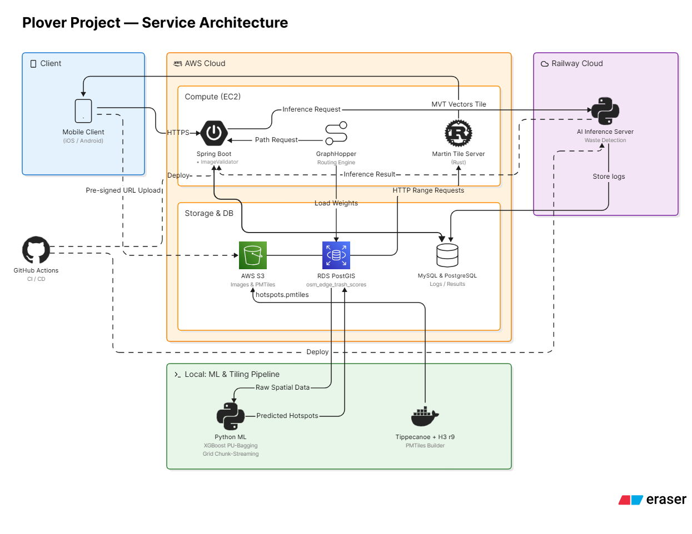

# Plover Backend

> 플로깅(plogging) 활동을 기록하고 경로를 추천하는 Spring Boot API 서버


Plover Backend는 플로깅 활동을 기록하고, 주변 편의 시설과 플로깅 경로를 제공하며, 플로깅 사진의 쓰레기 감지 결과를 저장하는 Spring Boot 기반 API 서버입니다.

주요 기능은 Kakao/Apple OAuth 로그인, JWT 인증, 플로깅 세션 기록/통계, 주변 쓰레기통/화장실 조회, 외부 Route Engine 기반 경로 추천, S3 Presigned URL 발급, AI 이미지 분석 연동입니다.

## 아키텍처



## 기술 스택

| 구분 | 기술 |
| --- | --- |
| Language | Java 21 |
| Framework | Spring Boot 4.x, Spring Web MVC |
| Persistence | Spring Data JPA, MySQL |
| Optional Storage | PostgreSQL, JdbcTemplate |
| Auth | JWT, Kakao OAuth, Apple OAuth |
| External | Route Engine API, AI Server API, AWS S3 |
| Cache | Caffeine |
| API Docs | Swagger UI |
| Test | JUnit 5, AssertJ, Mockito, Spring Boot Test |
| Load Test | k6 |
| Build/Deploy | Gradle, Docker |

## 주요 기능

| 도메인 | 기능                                                                                       |
| --- |------------------------------------------------------------------------------------------|
| Auth | Kakao OAuth code 로그인, Kakao Native SDK access token 로그인, Apple identity token 로그인, JWT 발급 |
| User | 내 정보 조회, 닉네임 변경, 프로필 이미지 Presigned URL 발급/저장, 회원 탈퇴, 누적 플로깅 통계 조회                        |
| Plogging | 플로깅 완료 기록 저장, 활동 목록/상세 조회, 월간/주간 통계 조회, 경로 좌표와 사진 URL 저장                                 |
| Facility | 현재 위치 기준 반경 1km 내 쓰레기통/화장실 조회                                                            |
| Route | 외부 Route Engine을 호출해 플로깅 추천 경로 조회                                                        |
| AI Analysis | 쓰레기 제보 이미지 업로드 후 외부 AI 서버에 비동기 분석 요청, 감지 결과 저장                                           |
| Storage | S3 Presigned PUT URL 발급, 기존 프로필 이미지 교체 시 S3 객체 삭제                                        |

## 프로젝트 구조

```text
src/main/java/com/plover/plover_be
  facility/       # 주변 쓰레기통, 화장실 조회
  global/         # 인증, JWT, 예외, 설정, S3 공통 모듈
  plogging/       # 플로깅 세션, 통계, 사진 AI 분석
  route/          # Route Engine 연동 및 경로 캐시
  user/           # OAuth 인증, 사용자 정보, 프로필

k6/
  data/           # 부하 테스트 위치 데이터
  scenarios/      # smoke/load/stress/AI 테스트 시나리오
  results/        # k6 실행 결과
```

## API 문서

Swagger UI:

```text
http://localhost:8080/swagger-ui/index.html
```

전체 API 스펙과 요청/응답 형식은 Swagger UI를 기준으로 확인합니다. README에는 서비스 흐름을 이해하는 데 필요한 대표 API만 정리합니다.

## 대표 API

| Method | Path | 설명 |
| --- | --- | --- |
| POST | `/api/auth/v2/kakao/login` | Kakao Native SDK access token 기반 로그인 |
| POST | `/api/plogging-sessions/complete` | 플로깅 완료 기록 저장 |
| GET | `/api/v1/routes` | Route Engine 기반 플로깅 추천 경로 조회 |
| POST | `/api/plogging/analyze` | 쓰레기 제보 이미지 AI 분석 요청 |

## 주요 설계

### 위치 기반 시설 조회

쓰레기통과 화장실 조회는 MySQL `ST_Distance_Sphere`를 사용합니다. 현재 위치 기준 반경 1,000m 이내 시설을 거리순으로 반환합니다.

### S3 Presigned URL 기반 이미지 업로드

서버가 파일을 직접 받지 않고 S3 Presigned PUT URL을 발급합니다. 클라이언트는 Presigned URL로 S3에 직접 업로드한 뒤, 최종 `objectUrl`을 서버에 저장합니다. 이 방식으로 애플리케이션 서버의 파일 업로드 트래픽과 메모리 사용을 줄입니다.

Presigned URL 유효 시간은 10분입니다.

### AI 이미지 분석 비동기 처리와 이기종 DB 분리

`POST /api/plogging/analyze`는 multipart 이미지를 검증한 뒤 비동기 executor에서 외부 AI 서버를 호출합니다. 이미지 분석이 사용자 응답 흐름을 막지 않도록 요청 접수와 분석 처리를 분리했습니다.

분석 결과는 서비스 조회와 운영 데이터를 위한 MySQL `trash_detections`에 저장합니다. PostgreSQL이 활성화되어 있으면 공간 분석용 원천 제보 데이터로 활용할 수 있도록 `raw_trash_reports`에도 `geometry` 형태로 별도 저장합니다.


## 성능 개선: Route API 병목 개선

### 문제 상황

k6 stress 테스트에서 `GET /api/v1/routes` 경로 추천 API가 주요 병목으로 확인되었습니다. 테스트는 총 13분 동안 최대 50 VU까지 증가시키는 방식으로 진행했습니다.

기존 구조에서는 비슷한 위도/경도 요청도 매번 외부 Route Engine API로 전달했습니다. k6 stress 테스트는 제한된 위치 데이터를 반복 사용하기 때문에 동일하거나 매우 유사한 경로 추천 요청이 많이 발생했고, 그 결과 Route Engine 호출 비용이 누적되었습니다.

개선 전에는 route API 응답 시간이 다른 API보다 크게 튀었습니다.

| 지표 | 개선 전 |
| --- | ---: |
| route avg | `956.06ms` |
| route p95 | `3149.45ms` |
| route p99 | `4577.34ms` |
| route max | `10322.25ms` |
| 전체 p95 | `483.51ms` |
| 전체 p99 | `2307.46ms` |

### 해결 방법

먼저 외부 Route Engine과의 timeout과 retry 횟수를 조정해보았지만, 반복 호출 비용 자체는 줄어들지 않았습니다. 
오히려 일부 요청에서 실패율만 늘어나고 응답 시간 개선은 거의 없었기 때문에, 외부 엔진 호출 빈도를 줄이는 방향으로 접근했습니다.

Route Engine 성공 응답에 Caffeine 기반 JVM 인메모리 캐시를 적용했습니다.

캐시 키는 다음 값으로 구성합니다.

- 위도 버킷
- 경도 버킷
- 요청 거리
- 정규화된 mode

위도/경도는 캐시 적중률을 높이기 위해 0.0005도 단위(거리 기준 약 44m~55m)로 격자화(버킷화)합니다.

캐시 정책:

| 항목 | 값 |
| --- | --- |
| 저장 위치 | Spring Boot 애플리케이션 JVM heap |
| 라이브러리 | Caffeine |
| 최대 엔트리 | `1,000` |
| TTL | `5분` |
| 캐싱 대상 | Route Engine 성공 응답만 |
| 실패 응답 | 캐싱하지 않음 |

핵심 흐름은 다음과 같습니다.

```java
public RouteDto.Response getRoute(double lat, double lon, int distance, String mode) {
    String normalizedMode = normalizeMode(mode);
    // RouteCacheKey.from 내부에서 위경도를 0.0005도 단위로 격자화하여 키 생성
    RouteCacheKey key = RouteCacheKey.from(lat, lon, distance, normalizedMode);
    return routeCache.get(key, ignored -> requestRouteFromEngine(lat, lon, distance, normalizedMode));
}
```

`mode`는 `null`, 공백, 소문자 입력으로 인한 캐시 미스를 줄이기 위해 진입 시점에 기본값 `PLOGGING`과 대문자 변환을 적용합니다.

### 개선 결과

같은 stress 조건에서 다시 측정한 결과, Route Engine 반복 호출이 줄어들면서 route API 응답 시간이 크게 개선되었습니다.

| 지표 | 개선 전 | 개선 후 | 개선율 |
| --- | ---: | ---: | ---: |
| route avg | `956.06ms` | `18.87ms` | `98.0%` |
| route p95 | `3149.45ms` | `35.64ms` | `98.9%` |
| route p99 | `4577.34ms` | `104.18ms` | `97.7%` |
| route max | `10322.25ms` | `434.67ms` | `95.8%` |
| 전체 avg | `114.96ms` | `32.61ms` | `71.6%` |
| 전체 p95 | `483.51ms` | `73.95ms` | `84.7%` |
| 전체 p99 | `2307.46ms` | `170.11ms` | `92.6%` |

### 처리량과 안정성:

| 지표 | 개선 전 | 개선 후 | 변화 |
| --- | ---: | ---: | ---: |
| 총 요청 수 | `38,605` | `46,966` | `21.7% 증가` |
| RPS | `49.47 req/s` | `60.21 req/s` | `21.7% 증가` |
| HTTP 실패율 | `0.0026%` | `0%` | 실패 제거 |
| checks 성공률 | `99.9974%` | `100%` | 성공률 개선 |

결론적으로 병목 원인은 Spring Boot 내부 연산보다 외부 Route Engine 반복 호출 비용에 가까웠습니다. 성공 응답 캐시 적용 후 route API p95는 `3149.45ms`에서 `35.64ms`로 감소했고, 전체 API p95도 `483.51ms`에서 `73.95ms`로 감소했습니다.

이 개선 효과는 동일하거나 유사한 위치 요청이 반복되는 상황에서 가장 큽니다. 모든 요청 좌표가 매번 완전히 달라지는 운영 트래픽에서는 캐시 적중률에 따라 개선 폭이 달라질 수 있습니다.

## k6 부하 테스트

k6 스크립트는 `k6/scenarios` 아래에 있습니다.

| 파일 | 목적 |
| --- | --- |
| `smoke-test.js` | 단일 VU 기반 기본 API 정상 동작 확인 |
| `load-test.js` | 일반 부하 상황 확인 |
| `stress-test.js` | 최대 50 VU까지 증가시키며 병목 확인 |
| `ai-analysis-smoke-test.js` | AI 이미지 분석 API 별도 smoke test |

기본 실행 예시:

```powershell
$env:BASE_URL = "http://localhost:8080"
$env:ACCESS_TOKEN = "<JWT>"
$env:INCLUDE_WRITE = "false"
k6 run k6/scenarios/stress-test.js
```

공개 저장소의 예시에는 운영 도메인을 직접 넣지 않습니다. 실제 테스트 시에는 본인이 관리하는 테스트 대상 URL로 `BASE_URL`을 바꿔 실행합니다.

결과는 다음 형식으로 저장됩니다.

```text
k6/results/stress-summary-YYYYMMDD-HHmmss.json
k6/results/stress-summary-YYYYMMDD-HHmmss.html
```
